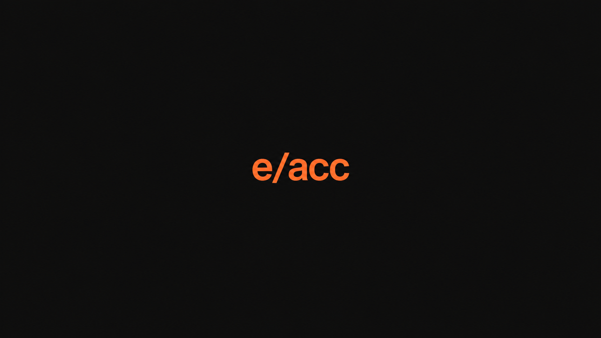

# e/acc

<a href="https://github.com/tcballard/omarchy-badges"></a>



*Wallpaper artwork. A real desktop screenshot is pending.*

Carbon black, reactor orange and warm white. A dark Omarchy theme with readable terminal colours and four wallpapers, from a quiet wordmark to a jump into hyperspace.

## Install

Once the implementation PR is merged:

```bash
omarchy theme install https://github.com/tcballard/omarchy-theme-e-acc
```

The derived install name is `theme-e-acc`. Installation applies the theme immediately. No compilation or extra fonts are required.

To test the current PR before merge:

```bash
git clone --branch feat/eacc-theme --single-branch https://github.com/tcballard/omarchy-theme-e-acc "$HOME/.config/omarchy/themes/theme-e-acc"
omarchy theme set theme-e-acc
```

If the destination already exists, stop and preserve your existing copy before updating it. To revert, select your previous theme in Omarchy's theme picker.

## Wallpapers

| Wallpaper | Character | Resolution |
| --- | --- | --- |
| Signal | Orange e/acc wordmark on carbon black; lead wallpaper | 1672×941 |
| Velocity | Orange light trails towards the horizon | 1672×941 |
| Icon Carbon | Original e/acc symbol, rendered directly from vector | 3840×2160 |
| Hyperdrive | Combined icon and wordmark with blue-white star trails | 1672×941 |

Use Omarchy's background picker to choose your wallpaper. Earlier experiments and the clean combined artwork are retained in `extras/`; they are not part of the installed wallpaper collection.

## Compatibility

Designed for Omarchy Quattro's semantic `colors.toml` templates. Installed Omarchy version tested: **pending**. Local palette, contrast and image checks pass; live desktop and Git-installed staging verification remain outstanding. See [validation](docs/validation.md).

The theme preserves native fonts, spacing and behaviour. It includes no install hooks or application configuration overrides.

## Credits

Theme configuration and documentation: Tom Ballard, MIT.

The original e/acc icon is by Will DePue, released under [CC0](https://commons.wikimedia.org/wiki/File:Effective_accelerationism_icon.svg). Signal, Velocity and Hyperdrive were generated with OpenAI's image tool. See [artwork provenance and terms](CREDITS.md).
